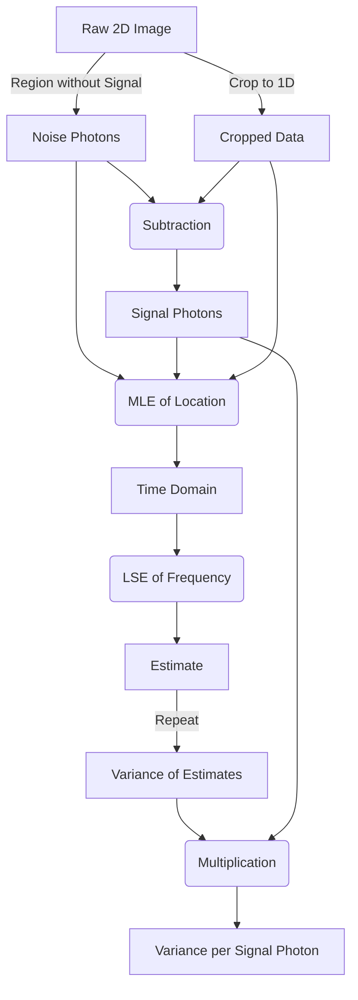

# README
## Intro

This repository contains the data processing scripts, simulation code, and datasets associated with our article “Measuring the Oscillation Frequency beyond the Diffraction Limit” (DOI: https://doi.org/10.1103/szcc-vk9r).

The raw data is quite large (approximately 413 GB before compression). As a result, the raw data is not publicly available at this time but may be obtained from the authors upon reasonable request.

**NOTE:** Not all raw data was used for estimation. The data actually used for estimation has been cropped and is available in the `Estimates` Python instance.


## Usage

```Python
from src import *

c = LoadEstimates('data/...') # Name a .npz file
c.cropped_data # Cropped data
c.estimates # Frequency estimates
```


## Flowchart




